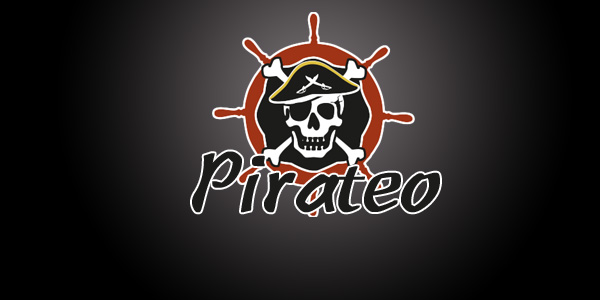
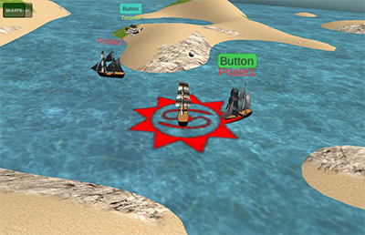

# Pirateo

Pirateo is a RPG game based on NEO blockchain. The players can act as a corsair and adventure the borderless Caribbean world. The essential features are:

1. **Use daily stock prices for resource allocation.**
2. **Essential logic implemented on NEO blockchain.** 
3. **Empowered by Unity, supports Web and Mobile.** 

Corsairs can collect Pimetals (The basic material in Pirateo's world) when they are sailing. Pimetals have four types: Wind, Soil, Fire and Water with different scarcities. Here's the basic rules for Pimetals collection:

1. Fix amount of Pimetals are released to different coordinates of Pirateo world every 24 hours (1 year in game world).
2. The distribution of the 4 Pimetals types are determined by the daily fluctuation of four NASDAQ stocks: GOOGL for Water, AAPL for Soil, AMZN for Wind, and MSFT for Fire, respectively. Say on July 31, we have GOOGL +2%, AAPL -1%, AMZN +4% and MSFT -2%, we have Water:Soil:Wind:Fire = 31%:12%: 52%: 5%. 
3. The corsairs find the pimetals on the sea, and hit them to collect. The corsair must stand for 3 minute without being bombarded or crashed by other corsairs or NPC creatures, in order to own the pimetal it collected. If it failed to do so, the pimetal would be transferred to the new owner, and the 3min count down resets.
4. Pimetals can be used to upgrade the corsairs by the attributes of attack, defense, speed, health, recoverage, etc. 
5. By the end of the 24 hours period by a catastrophe of either Tsunami, Earthquake, Typhoon or Conflagration. They'll destroy all the Pimetals of Fire, Water, Soil, Wind collected during that period. So the players should try best to use up Pimetals for upgrading as much as possible. 
6. Corsairs can also transact such Pimetals from other players with the negotiated price. 

Material:

Demo: https://leonhano.github.io/Build_SeaExplorer/

Github: https://github.com/leonhano/SeaExplorer

Contact: leonhano@gmail.com