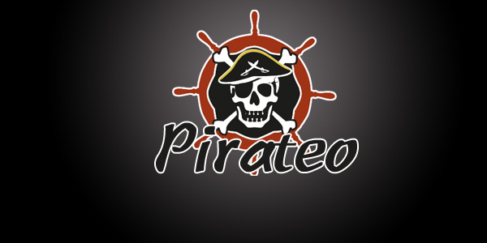
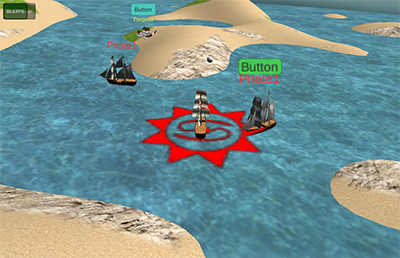

# 区块海盗船(Pirateo)

《区块海盗船(Pirateo)》是一个基于NEO区块链的RPG游戏。玩家扮演海盗船在无边界的加勒比世界探险。核心特性包括：

1. **读取每日股票行情**来影响智能合约决定世界里资源分配。

2. 核心逻辑实现在NEO区块链上。

3. 客户端基于Unity，支持Web和手机客户端。

   

海盗船可以在开放世界中航行搜集丕料（Pimetal, Pirateo世界中的基础材料）。有四种丕料类型：风、土、火和水。

**游戏基本规则**：

1. 在Pirateo世界中每一年（对应现实世界24小时），都会有固定总额度的丕料生成到世界的各个坐标上。
2. 每年新生成的各丕料比例是由现实生活中该日四只纳斯达克股票收盘涨幅决定的。分别是谷歌对水，苹果对土，亚马逊对风，微软对火。比如7月31日行情GOOGL +2%, AAPL -1%, AMZN +4% and MSFT -2%，则水:土:风:火 = 31%:12%: 52%: 5%。火是最稀有元素。如果当日股市因节假日没开盘，则四种元素比例均等。
3. 玩家操纵海盗船在地图上找到丕料，与其碰撞收集，然后必须依靠操作在之后的3分钟之内不被任何其他海盗船或NPC海怪接触或击沉。如果在3分钟内被接触，该丕料将转移到对方船上去，3分钟倒计时在该船上重启。
4. 收集到的丕料可以用以升级海盗船的攻击、防御、速度、HP和修复速度等特性。
5. 在每一“年”的年末都会随机发生以下灾难之一：海啸，地震、台风或烈火。他们将摧毁所有玩家库存的火、水、土、风丕料余量，以及全世界所有尚未被收集的丕料。因此玩家必须尽力在该年结束前用掉库存以避免浪费。
6. 玩家可以自由交易丕料。

**资料：**

试玩地址： https://leonhano.github.io/Build_SeaExplorer/

Github: https://github.com/leonhano/SeaExplorer

联系方式：leonhano@gmail.com